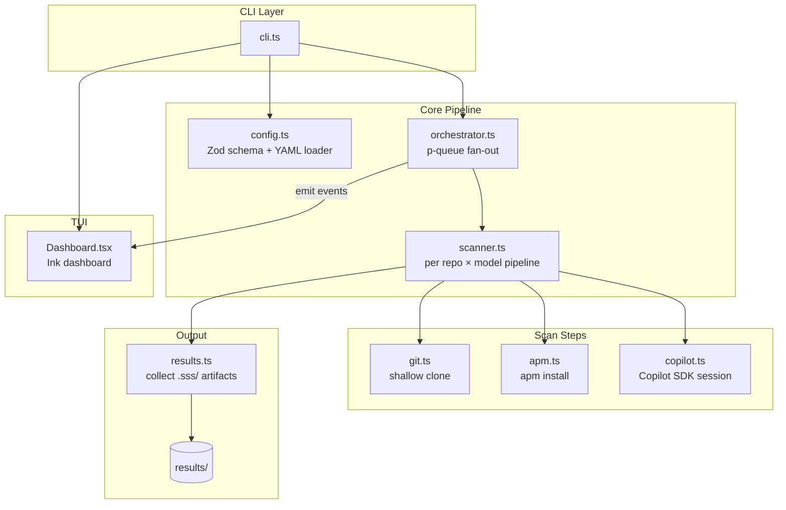

# Security Scan at Scale

A Node.js/TypeScript CLI that orchestrates security scans across many GitHub repositories and multiple LLM models in parallel. For each `(repo, model)` pair it clones the repo, optionally provisions agent primitives via `apm install`, and runs one or more fresh GitHub Copilot SDK sessions (one per configured command). Live progress is rendered in an Ink-based TUI dashboard, and outputs are persisted as per-scan Markdown reports plus an aggregated JSON/Markdown summary.

## Architecture

The following diagram shows how the main components interact during a run.



## Technology Stack

| Layer | Technology |
|---|---|
| Runtime | Node.js 18+, ESM |
| Language | TypeScript 5 (NodeNext, strict mode) |
| Dev runner | `tsx` (no build step needed for development) |
| CLI framework | `commander` |
| Config schema | `zod` + `js-yaml` |
| Concurrency | `p-queue` |
| Git operations | `simple-git` |
| APM provisioning | `apm` CLI + `execa` |
| Copilot sessions | `@github/copilot-sdk` |
| TUI | `ink` + `ink-spinner` + `react` |
| Env vars | `dotenv` |

## Prerequisites

| Tool | Notes |
|---|---|
| Node.js 18+ | ESM runtime |
| `git` CLI | Required for shallow clones |
| GitHub Copilot CLI | Must be installed and authenticated (`copilot --version`) |
| `apm` CLI | Used to provision agent primitives in each cloned repo |
| `GITHUB_TOKEN` | Required for private repo access and Copilot SDK auth |

## Setup

```bash
# 1. Install dependencies
npm install

# 2. Copy and fill in the example config
cp config.example.yml config.yml
# Edit config.yml: set repos, models, apmPack (optional), and one or more commands

# 3. Export your GitHub token (or add it to a .env file)
export GITHUB_TOKEN=ghp_...
# Alternatively: echo 'GITHUB_TOKEN=ghp_...' > .env

# 4. (Optional) Build for production
npm run build   # compiles TypeScript → dist/
```

## Usage

```bash
# Development — run directly with tsx (no build required)
npm run dev -- -c config.yml
npm run dev -- -c config.yml --no-ui

# Production — run compiled output (requires npm run build first)
npm start
npm start -- -c config.yml

# CI / plain-log mode
npm start -- --no-ui

# Override concurrency
npm start -- --concurrency 4

# Combine flags
npm start -- -c config.yml --concurrency 4 --no-ui
```

After `npm run build` the `security-scan` binary is also available:

```bash
./dist/cli.js -c config.yml
# or after `npm link` / `npm install -g .`:
security-scan -c config.yml
```

When the run finishes, each scan's `.sss/` artifacts are collected into `results/<owner>-<repo>/<model>/`, alongside that scan's `scan.log`.

## Configuration

Copy `config.example.yml` and fill in your values:

```yaml
concurrency: 6            # max parallel (repo, model) scans
workspaceDir: ./workspaces
resultsDir: ./results

models:
  - gpt-4.1
  # - claude-sonnet-4-5

repos:
  - url: https://github.com/your-org/your-repo
    # ref: main   # optional branch/tag/SHA

# Optional: APM pack to install into each cloned repo before scanning
apmPack: ricardocovo/agent-primitives

# One or more commands (each runs in a fresh Copilot session)
commands:
  - name: "Dependency Audit"
    prompt: "..."
  - name: "Secret Scan"
    prompt: "..."
  - name: "OWASP Top 10"
    prompt: "..."

sessionTimeoutMs: 600000  # 10 minutes per session
```

## Project Structure

```
src/
  cli.ts           # commander entrypoint
  config.ts        # Zod schema + YAML loader
  orchestrator.ts  # p-queue fan-out + EventEmitter bus
  scanner.ts       # per (repo, model) pipeline
  git.ts           # shallow clone via simple-git
  apm.ts           # apm.yml provisioning + apm install
  copilot.ts       # Copilot SDK session runner
  results.ts       # collect .sss/ artifacts into results/<owner>-<repo>/<model>/
  ui/
    Dashboard.tsx  # Ink TUI dashboard
```

## TUI Dashboard

When `--ui` is enabled (default), a live terminal dashboard is rendered using Ink. It shows one row per `(repo, model)` pair with the following columns:

| Column | Description |
|---|---|
| Repository | Short repo path (e.g. `your-org/your-repo`) |
| Model | Copilot model identifier |
| Step | Current pipeline step (`cloning…`, `apm install…`, command name, `done`, `failed`) |
| Elapsed | Time since the scan started |

**Elapsed time formatting** — both per-row and the overall footer timer display seconds (`12s`) for the first minute, then switch to minutes and seconds (`1m 12s`) once 60 seconds have elapsed.

A summary footer shows total, completed (✅), failed (❌), in-flight (⏳), and queued counts alongside the overall elapsed time. Press `Ctrl-C` to abort at any time.

## Outputs

| Path | Description |
|---|---|
| `results/<owner>-<repo>/<model>/` | Contents of the scan's `.sss/` folder (whatever the configured commands wrote) |
| `results/<owner>-<repo>/<model>/scan.log` | Per-scan log of pipeline events (clone, apm, command timings) |

## Contributing

1. Fork the repo and create a feature branch.
2. Run `npm install` and use `npm run dev` to iterate without a build step.
3. TypeScript is set to strict mode — keep it that way.
4. Add or update tests for any changed behaviour.
5. Open a pull request with a clear description of the change and why it is needed.

## Security Notes

- `GITHUB_TOKEN` is injected into clone URLs but **never** logged or written to any report.
- Use `--no-ui` in CI to avoid TTY requirements.
- Cloned repos are written to `workspaceDir` (default `./workspaces`); clean up after runs to reclaim disk space.
